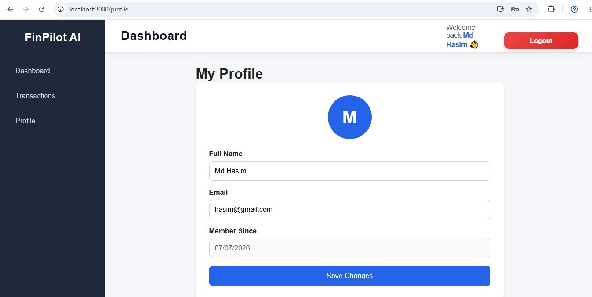
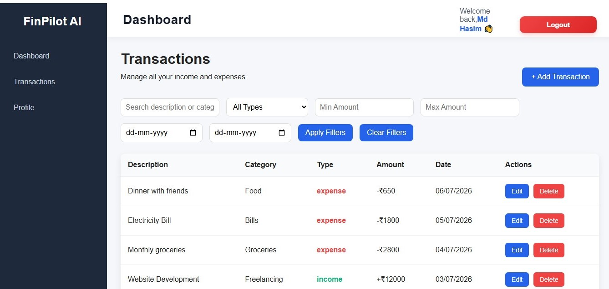
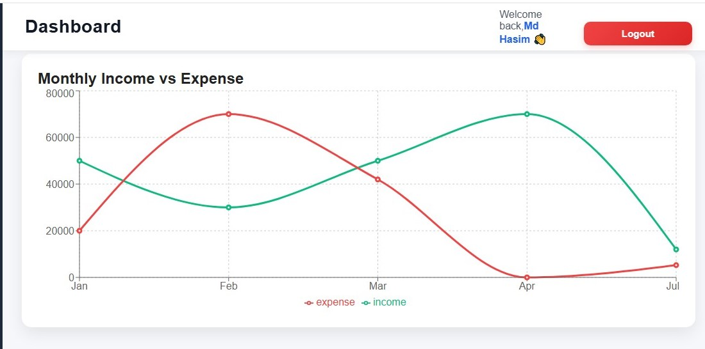
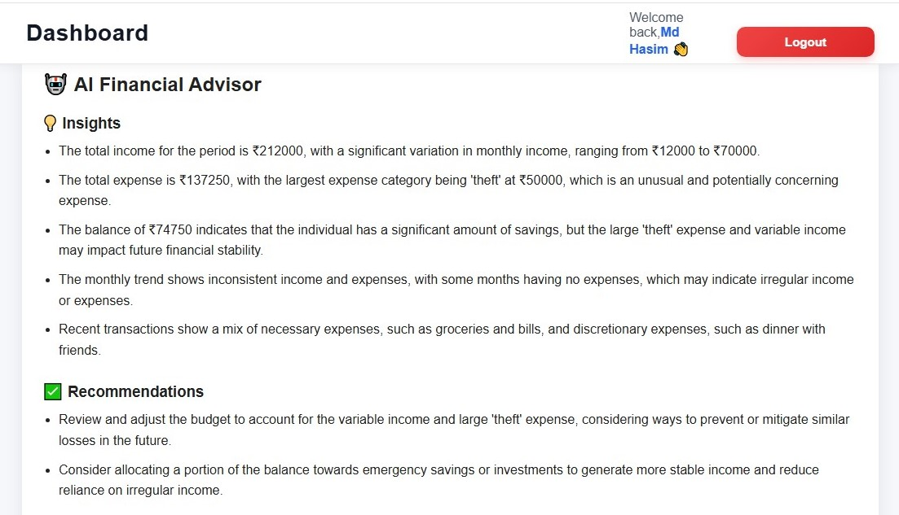
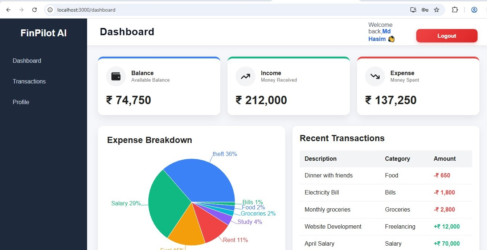
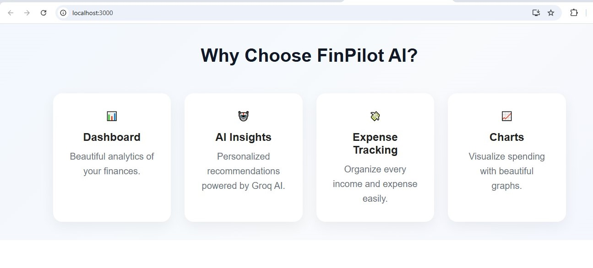
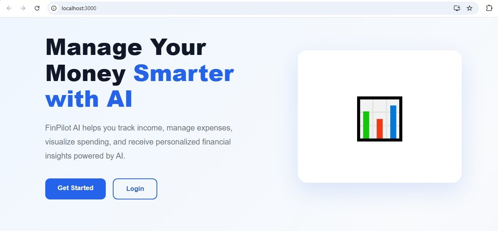

# 💰 FinPilot AI

FinPilot AI is a full-stack personal finance management application built with the MERN stack. It helps users manage their income and expenses, visualize spending trends, and receive AI-powered financial insights generated using Groq LLM.

---

## Features

### Authentication
- User Registration & Login
- JWT Authentication
- Protected Routes
- Profile Management

### Dashboard
- Total Balance
- Total Income
- Total Expenses
- Recent Transactions
- Expense Category Pie Chart
- Monthly Income vs Expense Trend
- AI Financial Insights

### Transactions
- Add Transaction
- Edit Transaction
- Delete Transaction
- Search by Description
- Search by Category
- Filter by Transaction Type
- Filter by Amount Range
- Filter by Date Range

### AI Insights
- Personalized financial analysis
- Spending pattern detection
- Savings recommendations
- Financial warnings
- Powered by Groq Llama 3.3

---

## Tech Stack

### Frontend
- React
- React Router
- Axios
- Recharts
- CSS
- React Icons

### Backend
- Node.js
- Express.js
- MongoDB
- Mongoose
- JWT Authentication
- bcrypt

### AI
- Groq API
- Llama 3.3 70B Versatile

---

## Screenshots

      

---

## Installation

### Clone

```bash
git clone https://github.com/Mdhasim-tech/finpilot-ai.git
```

## Backend

```bash
cd backend
npm install
npm run dev
```

## Frontend

```bash
cd frontend
npm install
npm start
```

## Environment Variables

```bash

PORT=5000
MONGO_URI=
JWT_SECRET=
GROQ_API_KEY=
```

## Future Improvements

```bash
Pagination
Export to PDF/Excel
Budget Goals
Email Reports
Dark Mode
AI Chat Assistant
Recurring Transactions
Mobile Responsive Improvements
```

